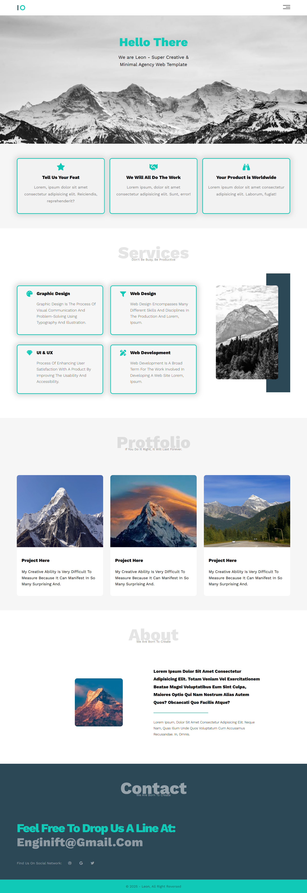
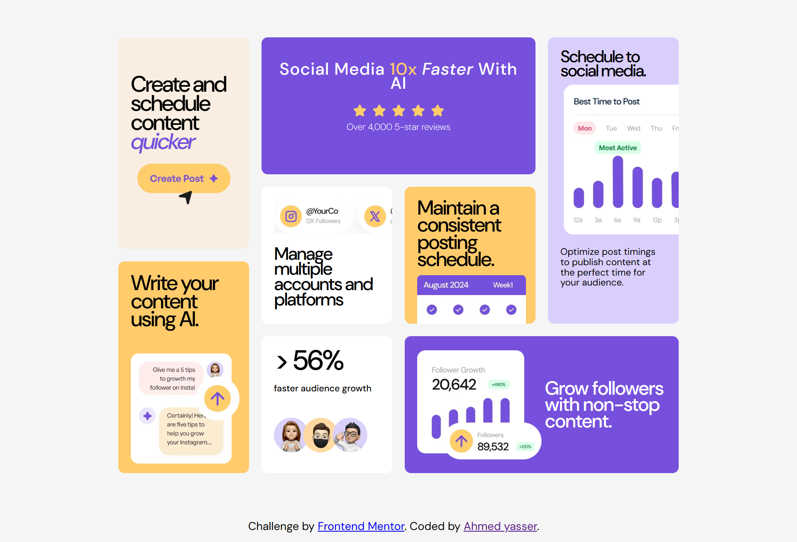
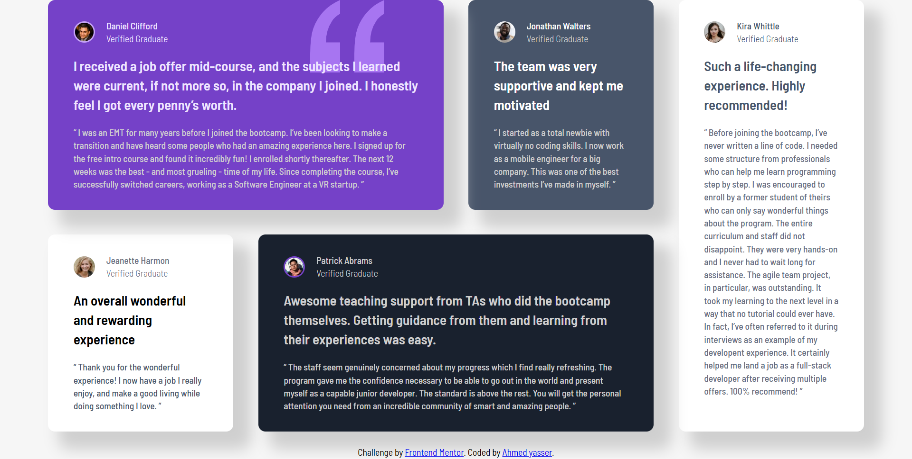
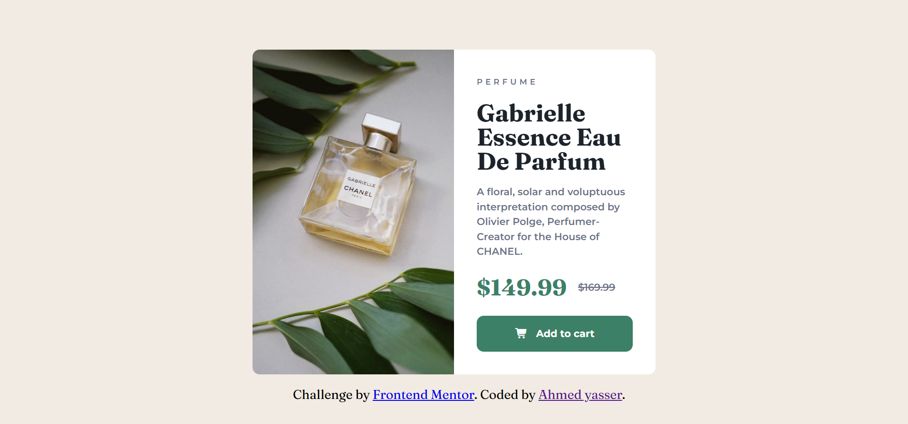
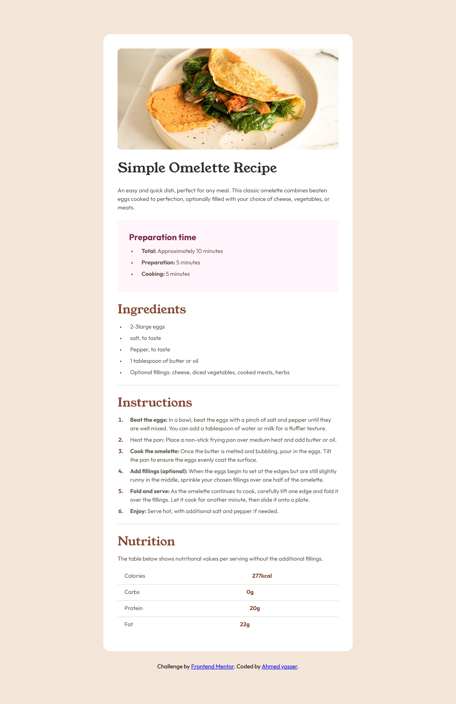
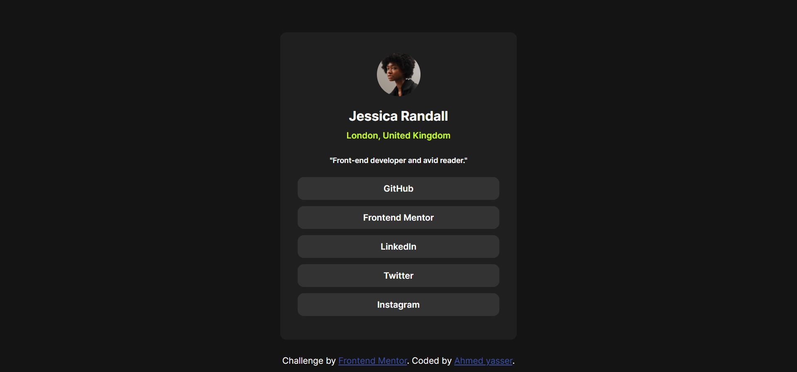
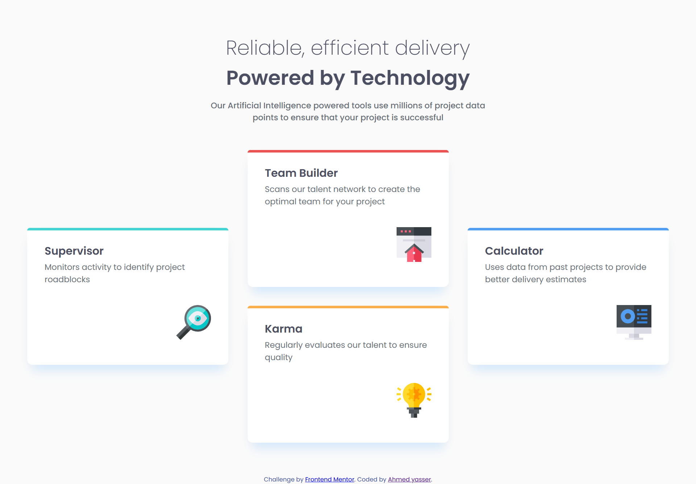

 <h1 align="center"> 🚀 Hi, I'm Ahmed </h1>
<h3 align="center">Passionate Front-End Developer | 15 Years Old</h3>

  
  
  
  

---

### 👤 About Me
I’m **Ahmed**, a 15-year-old Front-End Developer. For the past **6 months**, I’ve been coding for **8 hours daily**, diving deep into the "whys" and "hows" of web development. I focus on building pixel-perfect, responsive, and clean user interfaces.

* 🎯 **Completed:** 10 Projects (7 Frontend Mentor Challenges + 3 Multi-section Landing Pages).
* 🛠️ **Current Focus:** Mastering CSS Architecture (Sass & Tailwind).
* 🚀 **Future Goal:** Front end development starting with react.

---

### 💻 Technical Toolbox
| **Category** | **Skills / Tools** |
| --- | --- |
| **Languages** | HTML5, CSS3, Markdown |
| **Layouts** | Flexbox, CSS Grid, Responsive Design |
| **Tools** | Git, GitHub, Command Line, VS Code |
| **Concepts** | Clean Code, UI Layout Implementation, Cross-Browser Compatibility |

---

### 📂 Featured Projects (The Gallery)

| Project Preview | Details |
| :--- | :--- |
|  | **Ris landing hoodie (Ris)**  Official RIS Class of 2027 hoodie: high-quality, customizable, and stylish.   🔗 [ Live Demo](https://ahmed-let-front.github.io/RIS-hoodie/) \| [Repo](https://github.com/Ahmed-let-front/RIS-hoodie.git)   |
|  | **Agency Landing Page (Leon)** A professional multi-section template built from scratch. 🔗 [Live Demo](https://ahmed-let-front.github.io/leon-template/) \| [Repo](https://github.com/Ahmed-let-front/leon-template) |
|  | **Creative Agency (Kasper)** Modern landing page focusing on high-fidelity UI and clean code. 🔗 [Live Demo](https://ahmed-let-front.github.io/kasper-template-tow/) \| [Repo](https://github.com/Ahmed-let-front/kasper-template-tow) |
|  | **Bento Grid Layout** Mastering complex CSS Grid placements and responsive alignment. 🔗 [Live Demo](https://ahmed-let-front.github.io/bento-grid-front-end-mentor-/) \|[Repo](https://github.com/Ahmed-let-front/bento-grid-front-end-mentor-) |
|  | **Testimonials Grid** Mobile-first layout with custom shadow effects and clean typography. 🔗 [Live Demo](https://ahmed-let-front.github.io/testmonials/) \| [Repo](https://github.com/Ahmed-let-front/testmonials) |
|  | **Product Preview Card** Focused on art direction and responsive image switching. 🔗 [Live Demo](https://ahmed-let-front.github.io/product-chanel/) \| [Repo](https://github.com/Ahmed-let-front/product-chanel) |
|  | **Recipe Page** Organized layout using semantic HTML tables and custom lists. 🔗 [Live Demo](https://ahmed-let-front.github.io/recipe/) \| [Repo](https://github.com/Ahmed-let-front/recipe) |
|  | **Social Links Profile** Minimalist UI with smooth CSS hover transitions. 🔗 [Live Demo](https://ahmed-let-front.github.io/social-links/) \| [Repo](https://github.com/Ahmed-let-front/social-links) |
|  | **Four-Card Feature Section** Responsive multi-column grid with custom border accents. 🔗 [Live Demo](https://ahmed-let-front.github.io/four-product/) \| [Repo](https://github.com/Ahmed-let-front/four-product) |
|  | **QR Code Component** A simple, clean, and fully responsive QR component. 🔗 [Live Demo](https://ahmed-let-front.github.io/qr-code-frontend-meentor/) \| [Repo](https://github.com/Ahmed-let-front/qr-code-frontend-meentor) |

---

### 📈 Learning Journey & Achievements
1. **Consistency:** Coding every day for 8+ hours.
2. **Methodology:** Learning by understanding the "How" and "Why" behind every line of code.
3. **Control:** Proficient in using Command Line and Git for version control.
4. **Documentation:** Writing clear Markdown for better project maintenance.

---

### 📫 Connect with me

---

"Coding is not just about writing lines; it's about solving problems." 💻✨
