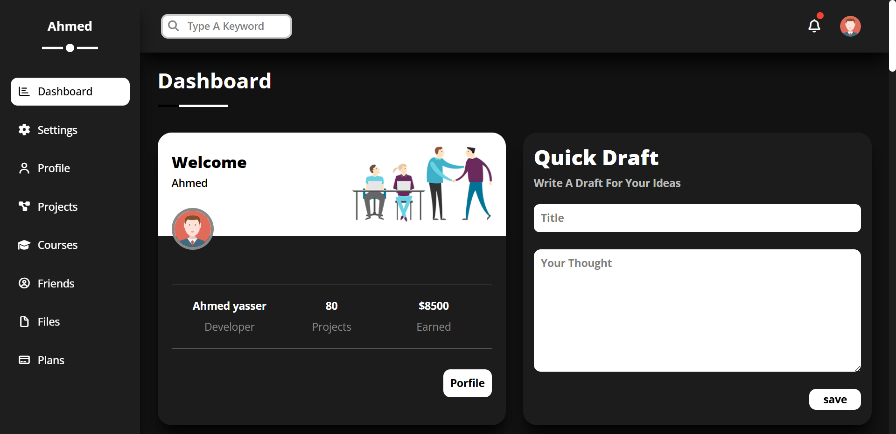
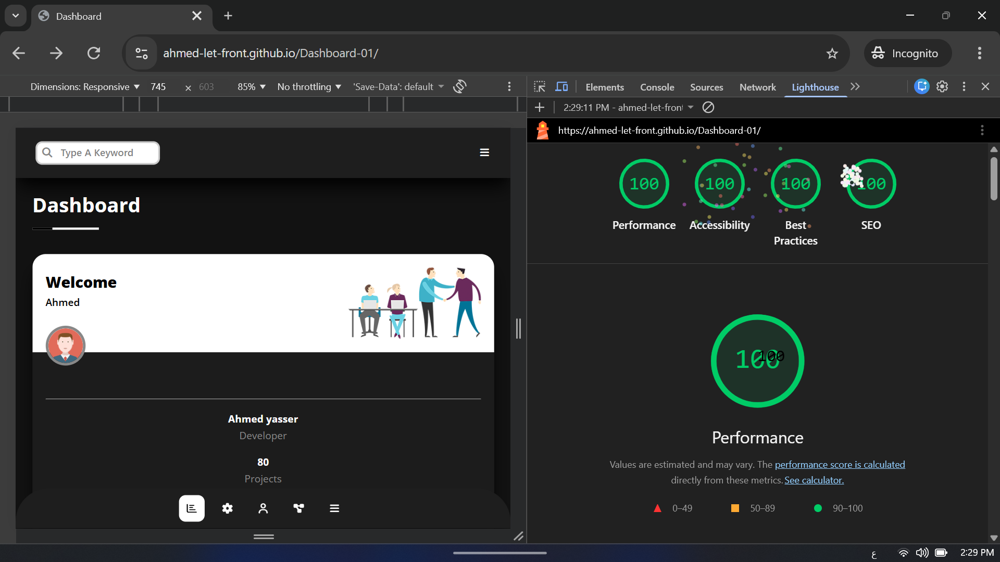
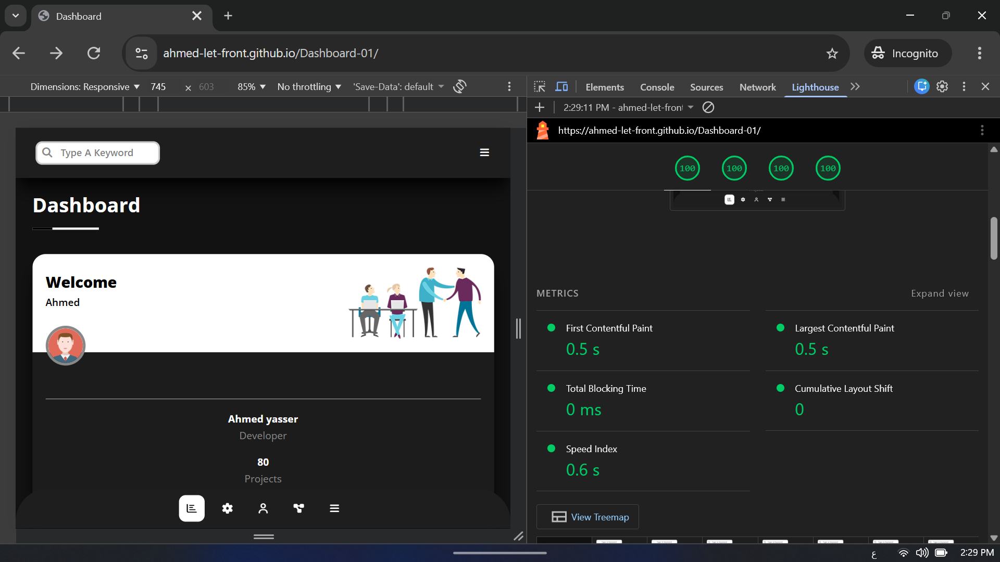

# 🚀 Hi, I'm Ahmed Yasser

### Junior Front-End Software Engineer | 15 Years Old

### 👤 The Engineering Mindset (About Me)

I’m **Ahmed**, a **Junior Front-End Software Engineer**. At 15, my approach goes beyond merely writing code; I engineer scalable, high-performance web solutions. Over the past **7 months**, I have dedicated **8 to 10 hours daily** (accumulating over 1,600+ hours of deep, focused coding) to mastering the complexities of the front-end ecosystem and the browser rendering engine.

In a record time of **just two months, I have successfully completed and deployed 15 distinct projects** (including 6 full-scale Applications/Landing Pages and 9 rigorous Frontend Mentor challenges).

**My Quality Baseline:**

- 🎯 **90%+ Pixel-Perfect Accuracy:** Bridging the gap between design and code flawlessly.
- ⚡ **The "400 Club" Standard:** I refuse to deploy unoptimized code. My recent projects guarantee 100/100 scores across **Performance, Accessibility, Best Practices, and SEO**.

---

### ⚙️ Under The Hood: Advanced Front-End Architecture

I don't just write HTML/CSS; I engineer how the browser interprets and paints it. My entire development lifecycle is strictly governed by a deep understanding of DOM architecture and CSS algorithms:

- **Strict DOM Semantics (The "Bag" Mental Model):** I strictly enforce W3C HTML semantics to guarantee 100% Screen Reader accessibility. A common architectural flaw is invalid list nesting. I navigate this using the **"Container Bag"** mental model: The `<ul>` is an outer bag strictly designed to hold only one type of item—the `<li>` (the inner carrier bag). You cannot throw random items directly into the outer bag. Furthermore, if you want a nested dropdown menu, the new `<ul>` (a new outer bag) **must** be placed inside an `<li>` (an inner bag), _never_ directly as a child of another `<ul>`.
- **Grid Mathematics (`auto-fit` vs `auto-fill`):** I master CSS Grid algorithms. By strategically utilizing `auto-fit`, I force the rendering engine to act as a visual garbage collector—collapsing empty "phantom" columns so flexible units (`1fr`) can flawlessly distribute space without layout fragmentation on ultra-wide screens.
- **Zero-JS State Management:** I actively reduce JavaScript payloads by pushing state mutations entirely to the CSS engine. I build highly interactive components (like toggles and menus) using CSS State Lifting, the `:has()` pseudo-class, and the `peer` combinator.
- **UX Precision (The "Block Link" Pattern):** To eliminate frustrating "dead click zones" in navigations, I aggressively strip physical dimensions from parent `<li>` wrappers and inject them directly into the anchor tags (`<a class="w-full h-full...">`), ensuring every physical pixel is instantly clickable.
- **Hardware Acceleration:** I exclusively use `transform` and `opacity` for animations, bypassing expensive layout/paint phases and pushing layers directly to the GPU for unblocked **60 FPS** performance.

---

### 🏆 Latest Project Spotlight: The Elite Admin Dashboard

As concrete proof of my engineering mindset, my most recent and complex architecture—the **8-page Elite Admin Dashboard**—shattered performance benchmarks.

By meticulously defining dimension constraints and enforcing strict GPU-accelerated animations, I achieved a flawless **100/100 across all four Lighthouse metrics** with a **0ms Total Blocking Time (TBT)**. More importantly, I engineered a rock-solid DOM layout that achieves a **0 Cumulative Layout Shift (CLS)** across the entire application, alongside sub-half-second First Contentful Paint (FCP).

---

---

---

### 📂 Featured Projects (The Gallery)

| Project Preview                                 | Details                                                                                                                                                                                                                                                                                                                                      |
| :---------------------------------------------- | :------------------------------------------------------------------------------------------------------------------------------------------------------------------------------------------------------------------------------------------------------------------------------------------------------------------------------------------- |
|                     | 🌟 **Elite Admin Dashboard** An advanced, meticulously engineered 8-page dashboard. Achieved a flawless 100/100 Lighthouse score on every single page with 0 CLS. 🔗 [Live Demo](https://ahmed-let-front.github.io/Dashboard-01/) \| [Repo](https://github.com/Ahmed-let-front/Dashboard-01)                                           |
|    | **Modern Agency Template (Web 3)** Built entirely with Tailwind CSS. Scored a flawless 100% across all metrics. 🔗 [Live Demo](https://ahmed-let-front.github.io/teamplate-web-3/) \| [Repo](https://github.com/Ahmed-let-front/teamplate-web-3.git)                                                                                   |
|                   | **RIS Landing Hoodie (Tailwind v4)** Refactored for maximum performance and clean utility classes. 🔗 [Live Demo](https://ahmed-let-front.github.io/RIS-hoodie/) \| [Repo](https://github.com/Ahmed-let-front/RIS-hoodie.git)                                                                                                          |
|    | **Clipboard Landing Page** A fully responsive, complex landing page crafted with precise semantic HTML and flexbox layouts. Achieved >95% pixel-perfect matching. 🔗 [Live Demo](https://ahmed-let-front.github.io/landing-page-in-frontend-mentor/) \| [Repo](https://github.com/Ahmed-let-front/landing-page-in-frontend-mentor.git) |
|                 | **Agency Landing Page (Leon)** A professional multi-section template built from scratch. 🔗 [Live Demo](https://ahmed-let-front.github.io/leon-template/) \| [Repo](https://github.com/Ahmed-let-front/leon-template)                                                                                                                  |
|                   | **Creative Agency (Kasper)** Modern landing page focusing on high-fidelity UI. 🔗 [Live Demo](https://ahmed-let-front.github.io/kasper-template-tow/) \| [Repo](https://github.com/Ahmed-let-front/kasper-template-tow)                                                                                                                |
|       | **Chat App CSS Illustration** Demonstrating advanced CSS layout techniques to build a responsive, complex mobile chat UI from scratch. 🔗 [Live Demo](https://ahmed-let-front.github.io/chat-app/) \| [Repo](https://github.com/Ahmed-let-front/chat-app.git)                                                                          |
|  | **Result Summary Component** A micro-interaction component focusing on clean UI, absolute positioning, and perfect spacing. 🔗 [Live Demo](https://ahmed-let-front.github.io/result-summary-component-main/) \| [Repo](https://github.com/Ahmed-let-front/result-summary-component-main)                                               |
|             | **Bento Grid Layout** Mastering complex CSS Grid placements and responsive alignment. 🔗 [Live Demo](https://ahmed-let-front.github.io/bento-grid-front-end-mentor-/) \| [Repo](https://github.com/Ahmed-let-front/bento-grid-front-end-mentor-)                                                                                       |
|            | **Testimonials Grid** Mobile-first layout with custom shadow effects and clean typography. 🔗 [Live Demo](https://ahmed-let-front.github.io/testmonials/) \| [Repo](https://github.com/Ahmed-let-front/testmonials)                                                                                                                    |
|              | **Product Preview Card** Focused on art direction and responsive image switching. 🔗 [Live Demo](https://ahmed-let-front.github.io/product-chanel/) \| [Repo](https://github.com/Ahmed-let-front/product-chanel)                                                                                                                       |
|                       | **Recipe Page** Organized layout using semantic HTML tables and custom lists. 🔗 [Live Demo](https://ahmed-let-front.github.io/recipe/) \| [Repo](https://github.com/Ahmed-let-front/recipe)                                                                                                                                           |
|        | **Social Links Profile** Minimalist UI with smooth CSS hover transitions. 🔗 [Live Demo](https://ahmed-let-front.github.io/social-links/) \| [Repo](https://github.com/Ahmed-let-front/social-links)                                                                                                                                   |
|   | **Four-Card Feature Section** Responsive multi-column grid with custom border accents. 🔗 [Live Demo](https://ahmed-let-front.github.io/four-product/) \| [Repo](https://github.com/Ahmed-let-front/four-product)                                                                                                                      |
|                     | **QR Code Component** A simple, clean, and fully responsive QR component. 🔗 [Live Demo](https://ahmed-let-front.github.io/qr-code-frontend-meentor/) \| [Repo](https://github.com/Ahmed-let-front/qr-code-frontend-meentor)                                                                                                           |
