

# 🚀 Hi, I'm Ahmed Yasser

### Junior Front-End Software Engineer | 15 Years Old

### 👤 The Engineering Mindset (About Me)

I’m **Ahmed**, a **Junior Front-End Software Engineer**. At 15, my approach goes beyond merely writing code; I engineer scalable, high-performance web solutions. Over the past **7 months**, I have dedicated **8+ hours daily** (accumulating over 1,600+ hours of deep, focused coding) to mastering the complexities of the front-end ecosystem.

In a record time of **just two months, I have successfully completed and deployed 14 distinct projects** (including 5 full-scale Landing Pages and 9 rigorous Frontend Mentor challenges).

**My Quality Baseline:**

- 🎯 **90%+ Pixel-Perfect Accuracy:** Bridging the gap between design and code flawlessly.
- ⚡ **95+ Minimum Lighthouse Score:** I refuse to deploy unoptimized code. Every project guarantees 95+ minimums across **Performance, Accessibility, Best Practices, and SEO**.

### ⚙️ Under The Hood: Performance & Browser Architecture

I don't just write HTML/CSS; I engineer how the browser interprets and paints it. My entire development lifecycle is strictly governed by a deep understanding of the **Critical Rendering Path (CRP)** and the **Browser Engine**:

- **CRP & Render Tree Optimization:** I engineer semantic HTML structures to ensure lightning-fast parsing and attachment. I actively avoid deep DOM nesting that bloats memory and chokes the Main Thread during the Critical Rendering Path.
- **Mastering Reflow (Layout) & Repaint:** I know exactly which CSS properties trigger geometry changes vs. pixel updates. I actively avoid animating layout-triggering properties (like `width`, `margin`, `top`) to prevent expensive synchronous layout thrashing.
- **Hardware Acceleration (Compositor Thread):** I exclusively use `transform` and `opacity` for animations, bypassing the layout/paint phases and pushing layers directly to the GPU (Compositor Thread) for buttery-smooth, unblocked 60fps performance.
- **Stacking Contexts & Memory Management:** I strategically manage render layers using `z-index`, `isolation`, and `will-change`, ensuring exact visual rendering while preventing browser RAM bloat from excessive layer creation.

### 🛠️ Deep Dive: The Tailwind CSS Mastery

Having fully mastered **Tailwind CSS**, I leverage it as an architectural tool rather than just a styling library.

- **Utility-First Architecture:** Building complex UIs without context-switching, directly within the markup.
- **Zero PlayCDN in Production:** I strictly configure **Vite** and **PostCSS** (with Autoprefixer and CSSNano) to build and purge my CSS, guaranteeing the smallest possible payload.
- **Modern v4.1 Engine:** Utilizing `@import "tailwindcss"` and native **CSS Variables** to harness the full power of the modern Just-In-Time (JIT) compiler.

### 💻 Technical Toolbox

| **Category**            | **Tools / Technologies**                                                                         |
| :---------------------- | :----------------------------------------------------------------------------------------------- |
| **Languages & Styling** | 🌐 HTML5, 🎨 CSS3, 💨 Tailwind CSS                                                               |
| **Workflow & Build**    | ⚡ Vite, 📦 PostCSS, 🐙 Git & GitHub, 💻 Command Line (CLI)                                      |
| **Core Competencies**   | 🚀 Web Performance, 🔍 SEO Optimization, 📱 Mobile-First Design, 🧠 Rendering Pipeline Awareness |

### 🏆 Latest Project Spotlight: The 100% Milestone

As concrete proof of my engineering mindset, my most recent project—the **Modern Agency Template (Web 3)**—achieved a flawless **100% across all four Lighthouse metrics** (Performance, Accessibility, Best Practices, SEO) with a **0ms Total Blocking Time (TBT)**. This milestone is the direct result of strict CRP optimization, semantic architecture, and advanced Tailwind CSS configuration.

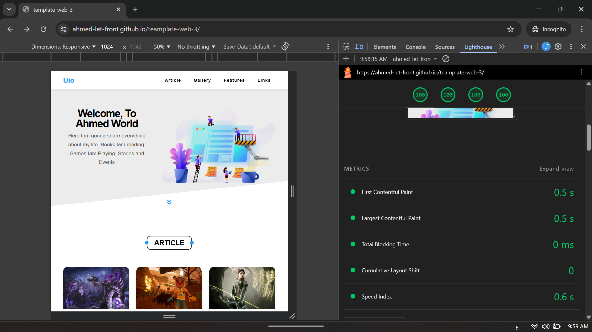

### 📂 Featured Projects (The Gallery)

| Project Preview                                 | Details                                                                                                                                                                                                                                                                                                                                      |
| :---------------------------------------------- | :------------------------------------------------------------------------------------------------------------------------------------------------------------------------------------------------------------------------------------------------------------------------------------------------------------------------------------------- |
|                   | **RIS Landing Hoodie (Tailwind v4)** Refactored for maximum performance and clean utility classes. 🔗 [Live Demo](https://ahmed-let-front.github.io/RIS-hoodie/) \| [Repo](https://github.com/Ahmed-let-front/RIS-hoodie.git)                                                                                                          |
|    | 🌟 **Modern Agency Template (Web 3)** My crowning achievement built entirely with Tailwind CSS. Scored a flawless 100% across all metrics. 🔗 [Live Demo](https://ahmed-let-front.github.io/teamplate-web-3/) \| [Repo](https://github.com/Ahmed-let-front/teamplate-web-3.git)                                                        |
| 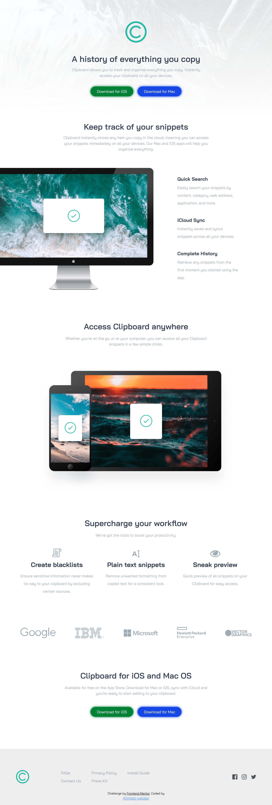   | **Clipboard Landing Page** A fully responsive, complex landing page crafted with precise semantic HTML and flexbox layouts. Achieved >95% pixel-perfect matching. 🔗 [Live Demo](https://ahmed-let-front.github.io/landing-page-in-frontend-mentor/) \| [Repo](https://github.com/Ahmed-let-front/landing-page-in-frontend-mentor.git) |
| 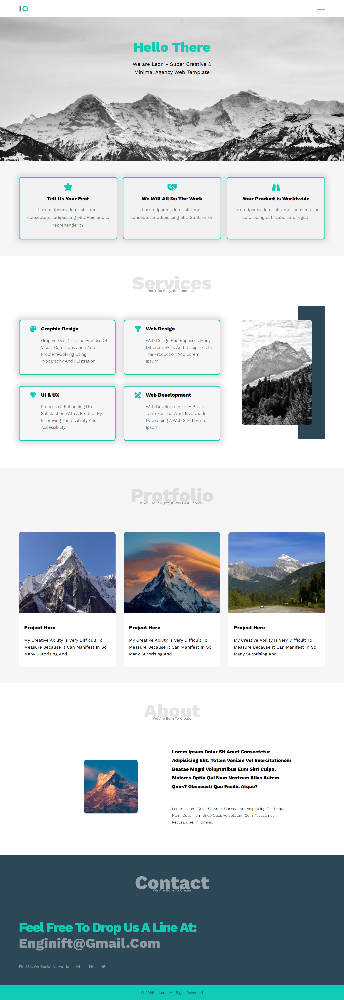                | **Agency Landing Page (Leon)** A professional multi-section template built from scratch. 🔗 [Live Demo](https://ahmed-let-front.github.io/leon-template/) \| [Repo](https://github.com/Ahmed-let-front/leon-template)                                                                                                                  |
|                   | **Creative Agency (Kasper)** Modern landing page focusing on high-fidelity UI. 🔗 [Live Demo](https://ahmed-let-front.github.io/kasper-template-tow/) \| [Repo](https://github.com/Ahmed-let-front/kasper-template-tow)                                                                                                                |
| 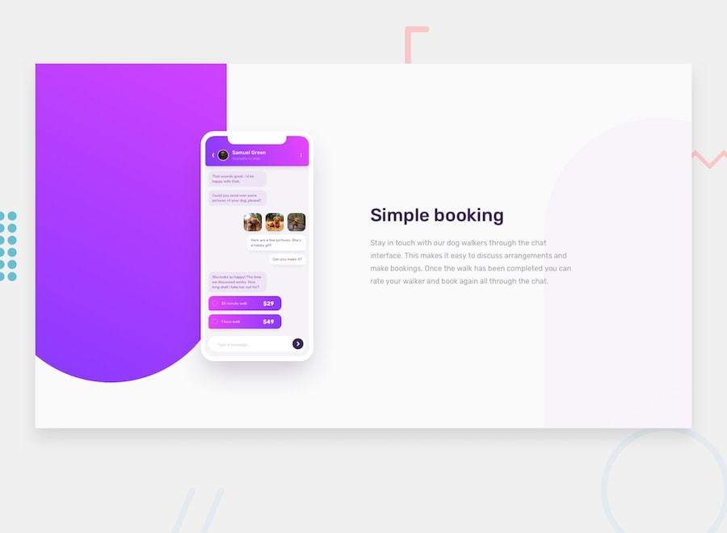      | **Chat App CSS Illustration** Demonstrating advanced CSS layout techniques to build a responsive, complex mobile chat UI from scratch. 🔗 [Live Demo](https://ahmed-let-front.github.io/chat-app/) \| [Repo](https://github.com/Ahmed-let-front/chat-app.git)                                                                          |
|  | **Result Summary Component** A micro-interaction component focusing on clean UI, absolute positioning, and perfect spacing. 🔗 [Live Demo](https://ahmed-let-front.github.io/result-summary-component-main/) \| [Repo](https://github.com/Ahmed-let-front/result-summary-component-main)                                               |
| 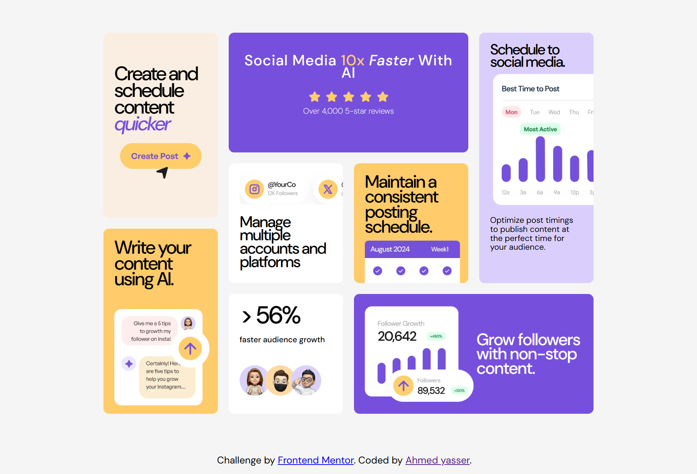            | **Bento Grid Layout** Mastering complex CSS Grid placements and responsive alignment. 🔗 [Live Demo](https://ahmed-let-front.github.io/bento-grid-front-end-mentor-/) \| [Repo](https://github.com/Ahmed-let-front/bento-grid-front-end-mentor-)                                                                                       |
| 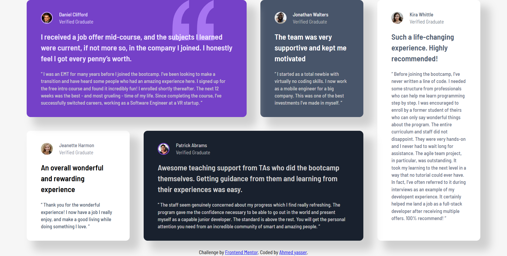           | **Testimonials Grid** Mobile-first layout with custom shadow effects and clean typography. 🔗 [Live Demo](https://ahmed-let-front.github.io/testmonials/) \| [Repo](https://github.com/Ahmed-let-front/testmonials)                                                                                                                    |
| 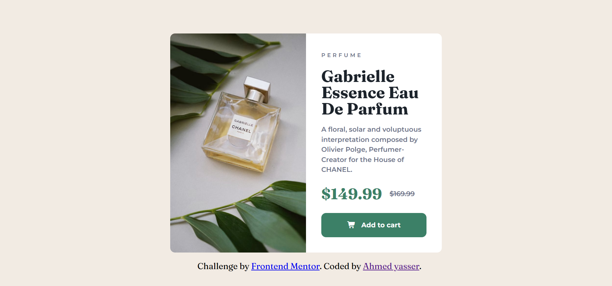             | **Product Preview Card** Focused on art direction and responsive image switching. 🔗 [Live Demo](https://ahmed-let-front.github.io/product-chanel/) \| [Repo](https://github.com/Ahmed-let-front/product-chanel)                                                                                                                       |
| 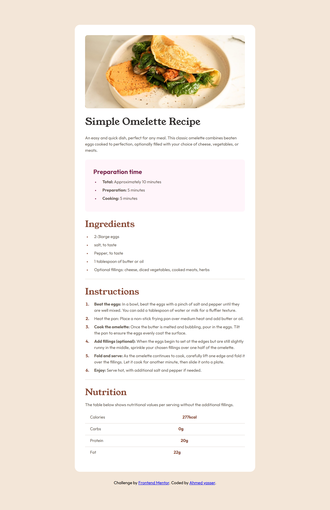                      | **Recipe Page** Organized layout using semantic HTML tables and custom lists. 🔗 [Live Demo](https://ahmed-let-front.github.io/recipe/) \| [Repo](https://github.com/Ahmed-let-front/recipe)                                                                                                                                           |
| 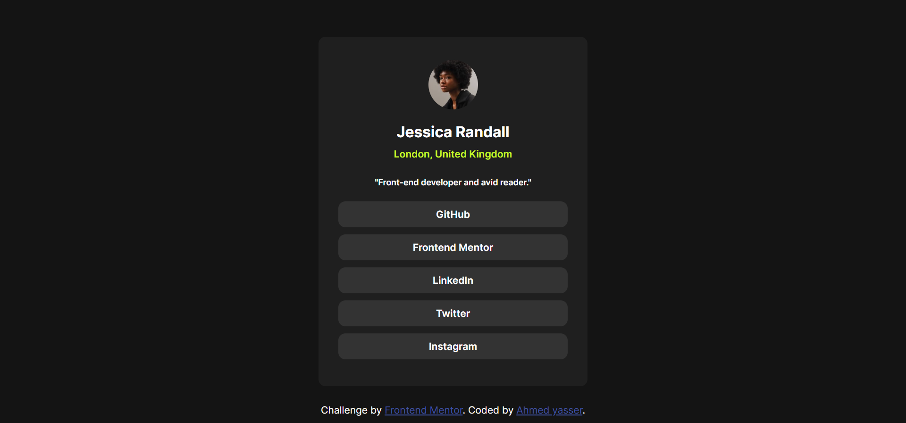       | **Social Links Profile** Minimalist UI with smooth CSS hover transitions. 🔗 [Live Demo](https://ahmed-let-front.github.io/social-links/) \| [Repo](https://github.com/Ahmed-let-front/social-links)                                                                                                                                   |
| 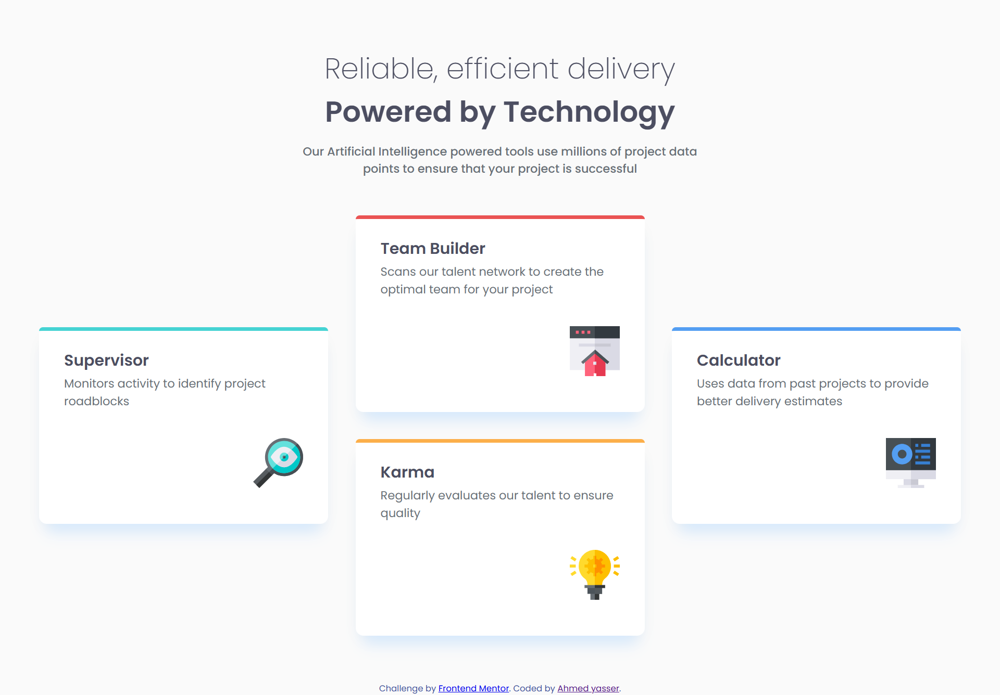  | **Four-Card Feature Section** Responsive multi-column grid with custom border accents. 🔗 [Live Demo](https://ahmed-let-front.github.io/four-product/) \| [Repo](https://github.com/Ahmed-let-front/four-product)                                                                                                                      |
| 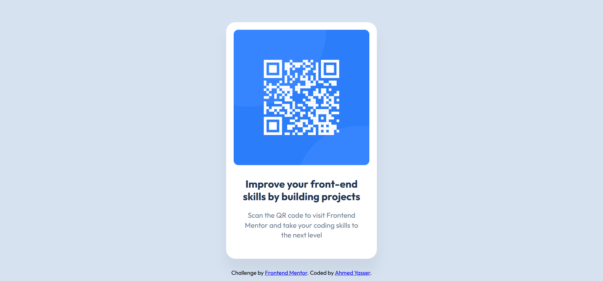                    | **QR Code Component** A simple, clean, and fully responsive QR component. 🔗 [Live Demo](https://ahmed-let-front.github.io/qr-code-frontend-meentor/) \| [Repo](https://github.com/Ahmed-let-front/qr-code-frontend-meentor)                                                                                                           |

---

# 🚀 أهلاً، أنا أحمد ياسر

### Junior Front-End Software Engineer | 15 سنة

### 👤 العقلية الهندسية (عني)

أنا **أحمد**، **Junior Front-End Software Engineer**. بالرغم من أن عمري 15 عاماً، إلا أن نظرتي للبرمجة لا تقتصر على كتابة سطور من الكود، بل بناء حلول وهيكلة أنظمة سريعة وفعّالة. على مدار الـ **7 شهور** الماضية، التزمت بالمذاكرة والتطبيق بمعدل **8 ساعات يومياً** (أكثر من 1600 ساعة عمل وتطوير).

في زمن قياسي خلال **شهرين فقط، قمت بإنهاء وإطلاق 14 مشروعاً بالكامل** (منهم 5 مواقع Landing Page كاملة، و 9 تحديات من Frontend Mentor).

**المعايير التي لا أتنازل عنها في كودي:**

- 🎯 تطابق التصميم بنسبة **90%+ (Pixel Perfect)**.
- ⚡ تحقيق تقييم **95+ كحد أدنى** على أداة Lighthouse في جميع المقاييس (الأداء، إمكانية الوصول، أفضل الممارسات، تحسين محركات البحث).

### ⚙️ ما وراء الكواليس: هندسة أداء المتصفح (Browser Architecture)

أنا لا أكتب أكواد HTML و CSS وتعمل بالصدفة؛ بل أهندس كيف سيقوم المتصفح بقراءتها ورسمها على الشاشة. كل سطر كود أكتبه محكوم بفهمي العميق لـ **مسار العرض الحرج (Critical Rendering Path)** وكيفية عمل محرك المتصفح:

- **تحسين مسار العرض الحرج (CRP):** أهندس هيكلة الـ DOM وأتجنب التداخل العميق (Deep Nesting) لضمان أقصى سرعة في بناء الـ Render Tree، مما يمنع إرهاق المعالج الأساسي (Main Thread) ويقلل وقت المعالجة.
- **السيطرة الكاملة على الـ Reflow والـ Repaint:** أعرف بدقة أي خصائص CSS تُجبر المتصفح على إعادة حساب الأبعاد (Layout Thrashing) وأيها يغير الألوان فقط. أتجنب تماماً تحريك خصائص مثل `width` أو `margin` أو `top` لمنع استهلاك موارد المعالج.
- **تسريع الهاردوير (GPU Compositing):** في الـ Animations، أعتمد حصرياً على خصائص `transform` و `opacity` لأن المتصفح ينقلها مباشرة إلى الـ Compositor Thread (كارت الشاشة GPU)، مما يضمن أداء 60fps سلس تماماً بدون أي تقطيع (Jank).
- **إدارة طبقات العرض (Stacking Contexts):** أتحكم بذكاء في طبقات العرض باستخدام `z-index` و `isolation` و `will-change`، لخلق طبقات مستقلة عند الحاجة فقط، مع الحذر من الإفراط فيها لتجنب استهلاك الـ RAM الخاص بالمتصفح بشكل غير مبرر.

### 🛠️ احتراف Tailwind CSS

بعد إتمام تعلمها، أصبحت أستخدم **Tailwind CSS** كأداة هندسية لبناء الواجهات:

- **نظام Utility-First:** يسمح لي ببناء واجهات معقدة وسريعة مباشرة داخل الـ HTML.
- **الأداء الفعلي:** لا أستخدم طريقة PlayCDN في بيئة العمل الحقيقية إطلاقاً. أعتمد على **Vite** و **PostCSS** لعمل Purge وضغط لملفات الـ CSS.
- **أحدث إصدار v4.1:** أستخدم التحديثات الجديدة عبر `@import "tailwindcss"` والتحكم بالـ CSS Variables للاستفادة القصوى من محرك الـ JIT (Just-In-Time) الذي يجعل حجم الملفات شبه معدوم.

### 💻 التقنيات والأدوات

| **الفئة**           | **الأدوات والتقنيات**                                                                          |
| :------------------ | :--------------------------------------------------------------------------------------------- |
| **اللغات والتنسيق** | 🌐 HTML5, 🎨 CSS3, 💨 Tailwind CSS                                                             |
| **سير العمل**       | ⚡ Vite, 📦 PostCSS, 🐙 Git & GitHub, 💻 Command Line (CLI)                                    |
| **مفاهيم احترافية** | 🚀 Web Performance, 🔍 SEO Optimization, 📱 Mobile-First Design, 🧠 Browser Rendering Pipeline |

### 🏆 أحدث مشاريعي: العلامة الكاملة في الأداء (100%)

كدليل عملي على تطبيق العقلية الهندسية، أحدث مشروع قمت بإنشائه—**مشروع الوكالة الحديث (Web 3)**—حقق العلامة الكاملة **100% في جميع مقاييس Lighthouse الأربعة** (الأداء، إمكانية الوصول، أفضل الممارسات، محركات البحث) مع تحقيق **0ms Total Blocking Time**. هذا الإنجاز هو النتيجة المباشرة للتطبيق الصارم لتحسينات الـ CRP والاستخدام المعماري النظيف لـ Tailwind CSS.

### 📂 معرض المشاريع (The Gallery)

| عرض المشروع                                 | التفاصيل                                                                                                                                                                                                                                                                                                                        |
| :------------------------------------------ | :------------------------------------------------------------------------------------------------------------------------------------------------------------------------------------------------------------------------------------------------------------------------------------------------------------------------------ |
|                   | **مشروع هودي RIS (بواسطة Tailwind)**  تم إعادة بنائه بالكامل باستخدام Tailwind v4 لضمان أقصى سرعة.   🔗 [ رابط الموقع](https://ahmed-let-front.github.io/RIS-hoodie/) \| [المستودع](https://github.com/Ahmed-let-front/RIS-hoodie.git)                                                                                    |
|  | 🌟 **مشروع الوكالة الحديث (Web 3)** بنيت هذا المشروع باستخدام Tailwind CSS، وحققت فيه العلامة الكاملة **100% في جميع مقاييس Lighthouse**. 🔗 [رابط الموقع](https://ahmed-let-front.github.io/teamplate-web-3/) \| [المستودع](https://github.com/Ahmed-let-front/teamplate-web-3.git)                                      |
|   | **صفحة هبوط (Clipboard)** صفحة هبوط معقدة ومتجاوبة بالكامل مبنية بالاعتماد على HTML الدلالية وتقنيات Flexbox. نسبة تطابق التصميم فاقت الـ 95%. 🔗 [رابط الموقع](https://ahmed-let-front.github.io/landing-page-in-frontend-mentor/) \| [المستودع](https://github.com/Ahmed-let-front/landing-page-in-frontend-mentor.git) |
|                      | **صفحة وكالة (Leon)** قالب احترافي متعدد الأقسام مبني من الصفر. 🔗 [رابط الموقع](https://ahmed-let-front.github.io/leon-template/) \| [المستودع](https://github.com/Ahmed-let-front/leon-template)                                                                                                                        |
|         | **وكالة كاسبر الإبداعية (Kasper)** صفحة هبوط عصرية تركز على دقة التصميم ونظافة الكود. 🔗 [رابط الموقع](https://ahmed-let-front.github.io/kasper-template-tow/) \| [المستودع](https://github.com/Ahmed-let-front/kasper-template-tow)                                                                                      |
|                | **تطبيق محادثة (Chat App)** تطبيق متقدم لتخطيط الـ CSS لبناء واجهة محادثة متجاوبة ومعقدة للموبايل من الصفر. 🔗 [رابط الموقع](https://ahmed-let-front.github.io/chat-app/) \| [المستودع](https://github.com/Ahmed-let-front/chat-app.git)                                                                                  |
|          | **مكون النتيجة (Result Summary)** مكون Micro-interaction يركز على الواجهة النظيفة، التحكم المطلق في الأماكن، والمسافات الدقيقة. 🔗 [رابط الموقع](https://ahmed-let-front.github.io/result-summary-component-main/) \| [المستودع](https://github.com/Ahmed-let-front/result-summary-component-main)                        |
|          | **تنسيق Bento Grid** إتقان توزيع العناصر المعقدة باستخدام CSS Grid. 🔗 [رابط الموقع](https://ahmed-let-front.github.io/bento-grid-front-end-mentor-/) \| [المستودع](https://github.com/Ahmed-let-front/bento-grid-front-end-mentor-)                                                                                      |
|           | **شبكة التقييمات** تصميم Mobile-first مع تأثيرات ظلال مخصصة وتنسيق نصوص نظيف. 🔗 [رابط الموقع](https://ahmed-let-front.github.io/testmonials/) \| [المستودع](https://github.com/Ahmed-let-front/testmonials)                                                                                                              |
|                     | **كارت منتج (Chanel)** التركيز على التصميم المتجاوب وتغيير الصور حسب الشاشة. 🔗 [رابط الموقع](https://ahmed-let-front.github.io/product-chanel/) \| [المستودع](https://github.com/Ahmed-let-front/product-chanel)                                                                                                         |
|                | **صفحة وصفة طعام** تنسيق منظم باستخدام جداول HTML الدلالية والقوائم. 🔗 [رابط الموقع](https://ahmed-let-front.github.io/recipe/) \| [المستودع](https://github.com/Ahmed-let-front/recipe)                                                                                                                                 |
|      | **صفحة روابط التواصل** واجهة بسيطة مع تأثيرات Hover ناعمة باستخدام CSS. 🔗 [رابط الموقع](https://ahmed-let-front.github.io/social-links/) \| [المستودع](https://github.com/Ahmed-let-front/social-links)                                                                                                                  |
|    | **قسم المميزات الأربعة** شبكة متجاوبة متعددة الأعمدة مع حدود ملونة مخصصة. 🔗 [رابط الموقع](https://ahmed-let-front.github.io/four-product/) \| [المستودع](https://github.com/Ahmed-let-front/four-product)                                                                                                                |
|                       | **مكون كود QR** مكون بسيط ونظيف ومتجاوب بالكامل. 🔗 [رابط الموقع](https://ahmed-let-front.github.io/qr-code-frontend-meentor/) \| [المستودع](https://github.com/Ahmed-let-front/qr-code-frontend-meentor)                                                                                                                 |

---

"البرمجة مش مجرد كتابة سطور كود؛ هي عبارة عن هندسة وحل للمشكلات." 💻✨

